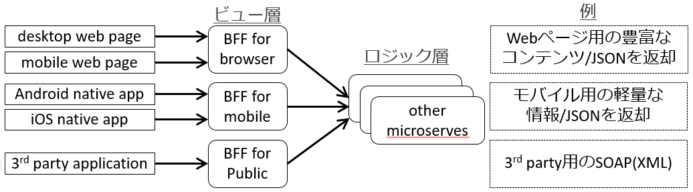
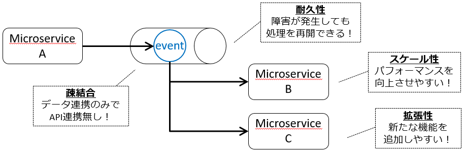
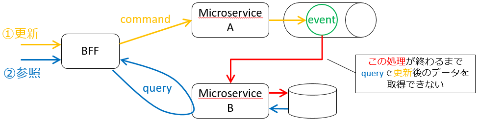

1. SOLID から IDEALS へ
2. The Twelve-Factor App から Beyond the Twelve Factor App へ

<!--more-->

## 1. SOLID から IDEALS へ

オブジェクト指向設計の 5 つの原則 **SOLID**

- Single-responsibility principle: 単一責任の原則 
- Open/closed principle: 開放閉鎖の原則
- Liskov substitution principle: リスコフの置換原則
- Interface segregation principle: インターフェース分離の原則 
- Dependency inversion principle: 依存性逆転の原則

SOLID に対してマイクロサービスの特性を考慮した原則 **IDEALS** 

- Interface segregation: インターフェイス分離
- Deployability (is on you): デプロイ容易性
- Event-driven: イベント駆動
- Availability over consistency: 整合性よりも可用性
- Loose coupling: 疎結合
- Single responsibility: 単一責任

### Interface segregation: インターフェイス分離

マイクロサービスの拡張性を維持するため、 **関心事は分離** する。

- **API ゲートウェイパターン** : 共通の入り口
  - メッセージ・プロトコル変換、セキュリティ制御、スロットリングとクォータ、など
- **BFF パターン** : クライアントに応じた入り口
  - web 用、モバイル用、3rd party 用、など

### Deployability (is on you): デプロイ容易性

監視対象・デプロイ回数の **増加に対応** する。

- 変更・管理しやすいインフラ
  - コンテナオーケストレーション、 FaaS 、 IaC 、など
- **可観測性**
  - トランザクション追跡： Zipkin 、 Jaeger 、 AWS X-Ray 、など
  - 監視： New Relic 、 CloudWatch 、 Datadog 、 Prometheus 、 Grafana 、など
  - ログ統合： Fluentd 、 Graylog 、 Splunk 、 ELK 、など
- サービス間連携
  - サービスメッシュ（ Istio 、 Linderd 、 Consul Connect 、など）
- デプロイ・リリース戦略
  - Blue/Green 、 カナリア 、 ローリングアップデート、など
- CI/CD・DevOps・GitOps
  - Jenkins 、 GitLabCI/CD 、 Spinnaker 、 Weaveworks 、 Flux 、 AgroCD 、など

### Event-driven: イベント駆動

**スケーラビリティ** と **スループット** を向上させる。  
クライアントからのリクエスト処理には同期型と非同期型があり、 **非同期** をうまく使う。

- **コレオグラフィ**
  - マイクロサービス間を非同期連携するパターン
  - キューや Pub/Sub を利用

### Availability over consistency: 整合性よりも可用性

整合性ではなく、 **結果整合性** を確保する。

- コマンドクエリ責務分離（ **CQRS** ）パターン
  - CRUD を 更新（ CUD ）と参照（ R ）に分割する
  - 更新（ CUD ）を **command** 、参照（ R ）を **query** という
- イベントソーシング（ **ES** ）パターン
  - **イベント** を記録し、 **イベント** を時系列に実行する

### Loose coupling: 疎結合

拡張性を維持するため、マイクロサービス間の依存性を無くす。

- Pub/Sub
  - 非同期にして一度トランザクションを断つ
  - データの送信者と受信者は違いを知らず、データだけの関係
- API ゲートウェイ と BFF
  - 関心事の分離
- ハイパーメディア
  - テキストや画像などのデータ情報をリンク（ URL ）で表現
- マクロサービス毎にデータベース
  - データベースを共有しない
- Consumer Driven Contract ( CDC )
  - Consumer/Provider 間の Contract
  - アーキテクチャレベルの TDD

### Single responsibility: 単一責任

マイクロサービスの **粒度・サイズは適切に** する。

- ドメイン駆動設計（ **DDD** ）

## 2. The Twelve-Factor App から Beyond the Twelve Factor App へ

### The Twelve-Factor App

クラウド時代のベストプラクティス [The Twelve-Factor App](https://12factor.net/ja/)

- 1. Codebase （ **コードベース** ） : バージョン管理されている1つのコードベースと複数のデプロイ
- 2. Dependencies （ **依存関係** ） : 依存関係を明示的に宣言し分離する
- 3. Config （ **設定** ） : 設定を環境変数に格納する
- 4. Backing services （ **バックエンドサービス** ） : バックエンドサービスをアタッチされたリソースとして扱う
- 5. Build, release, run （ **ビルド、リリース、実行** ） : ビルド、リリース、実行の3つのステージを厳密に分離する
- 6. Processes （ **プロセス** ） : アプリケーションを1つもしくは複数のステートレスなプロセスとして実行する
- 7. Port binding （ **ポートバインディング** ） : ポートバインディングを通してサービスを公開する
- 8. Concurrency （ **並行性** ） : プロセスモデルによってスケールアウトする
- 9. Disposability （ **廃棄容易性** ） : 高速な起動とグレースフルシャットダウンで堅牢性を最大化する
- 10. Dev/prod parity （ **開発/本番一致** ） : 開発、ステージング、本番環境をできるだけ一致させた状態を保つ
- 11. Logs （ **ログ** ） : ログをイベントストリームとして扱う
- 12. Admin processes （ **管理プロセス** ） : 管理タスクを1回限りのプロセスとして実行する

### Beyond the Twelve Factor App

クラウドネイティブ時代のベストプラクティス [Beyond the Twelve Factor App](https://tanzu.vmware.com/content/ebooks/beyond-the-12-factor-app)

- 1. One codebase, one application （ **1 コードベース、 1 アプリケーション** ）
  - 1 アプリケーション = 1 コードベース = 1 リポジトリでバージョン管理
  - 環境差分は環境変数で吸収する作りにして 1 コードベースから複数環境（ dev/tst/stg/prd ）でデプロイ可能にする
- 2. API first（ **API ファースト** ）
  - 最初に API を設計して、 API を利用する他チームとの調整を容易にする
  - Swagger 、 Apiary 、 gRPC などのサポートツールを利用する
  - CI により結合点を継続的にテストすることで、チームそれぞれが独立のサービスに注力できるようにする
- 3. Dependency management （ **依存関係管理** ）
- 4. Design, build, release, and run （ **設計、ビルド、リリース、実行** ）
  - Design -> Build -> Release -> Run をそれぞれ個別のフェーズで実行する
  - 自動テスト・デプロイを行い、高信頼性を保ちながら CI スピードを最大化する
  - **Design**
    - ライブラリ依存関係を宣言
    - 設計は一度に全て行わず、小さな単位で設計・実装を繰り返す
  - **Build**
    - Design 時に宣言されたライブラリ依存関係を含めて CI を利用してコードを実行形式に変換
    - 1 ビルドで任意の環境（ dev/tst/stg/prd ）でリリース・実行可能な状態にする
  - **Release**
    - ビルド成果物と環境毎の設定と組み合わせ、実行できる形に
    - 一意のリリースバージョンを付与（セマンティックバージョニング）
    - 以前のリリースバージョンにロールバックできること
  - **Run**
    - 実行形式・環境設定をコンテナに配置して、プロセスを起動・開始
    - プロセスが実行されると、マネージドサービスは実行を監視し、ログを集約し、スケールアウト・インに対応する
- 5. Configuration, credentials, and code （ **設定、機密情報、コード** ）
- 6. Logs （ **ログ** ）
- 7. Disposability （ **破棄容易性** ）
- 8. Backing services （ **バックエンドサービス** ）
- 9. Environment parity （ **環境一致** ）
- 10. Administrative processes （ **管理プロセス** ）
  - 管理プロセス（ cron など）はアプリケーションから分離する
    - アドホックな機能呼出のためのエンドポイント（ REST など）を公開
    - メインアプリからバッチ関連のコードを切り出し、別のマイクロサービスにする
  - 管理タスクはマネージドサービスを利用
    - 自分で実装することは避け、 AWS Lambda などを利用する
- 11. Port binding （ **ポートバインディング** ）
  - ポートバインディングはやめて、コンテナでサービスを公開する
    - 1 つのコンテナ内で複数のアプリケーションを起動しないこと
    - 公開するエンドポイントは、コードを変更せずに外部から設定できるようにすること
- 12. Stateless processes （ **ステートレスプロセス** ）
- 13. Concurrency （ **平行性** ）
- 14. Telemetry （ **テレメトリー** ）
  - APM （パフォーマンス）、 KPI （ビジネス指標） 、死活監視が必要
    - リクエスト数、スループット、 TAT など
    - ビジネス予測・分析のためのイベント・データを収集
    - プロセス起動数・状態、スケーリング、ヘルスチェック結果など
  - 早い段階で監視戦略を計画し、どの情報を収集・集約し、どの程度の期間・量を保存するのかを考える
- 15. Authentication and authorization （ **認証・認可** ）
  - クラウドネイティブアプリケーションは **RBAC** （ Role Based Access Control : ロールベースのアクセス制御）でエンドポイントを保護する
  - どのユーザのリクエストなのか認証し、リソースへの操作を許可する
  - IP での制限は管理が大変なのでやめる