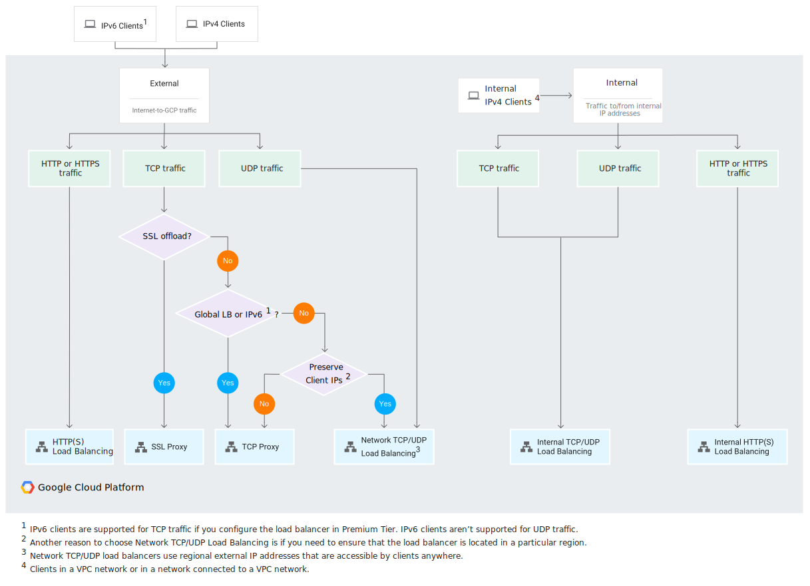
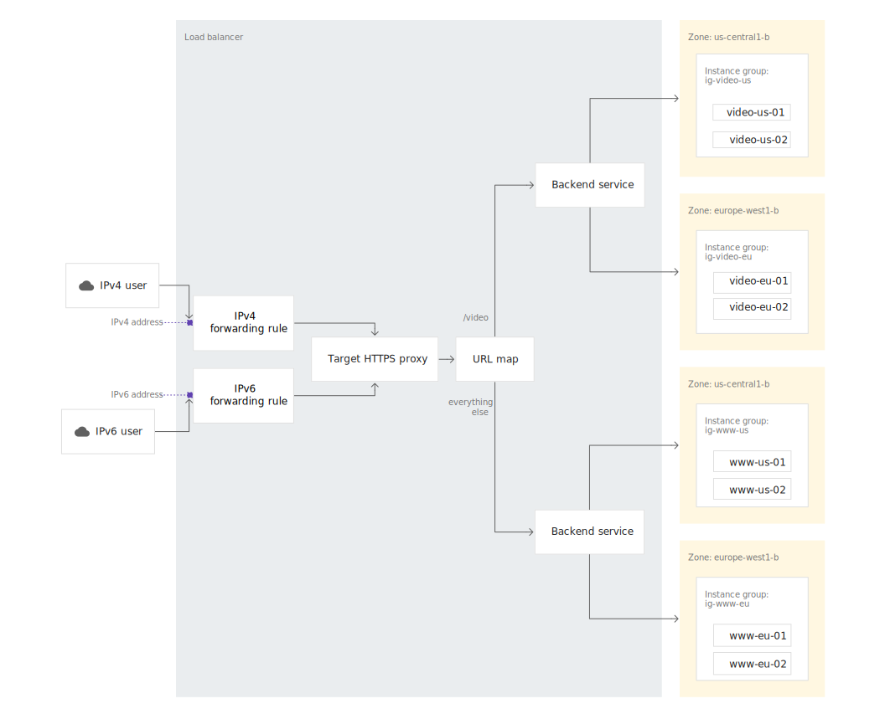

<!--more-->

Cloud Load Balancing

1. 種類
2. 作成
3. ユースケース

## 1. 種類

Cloud Load Balancing の負荷分散の種類には以下がある。

|種類|内部/外部|リージョン/グローバル|プロキシ/パススルー|Docs|補足|
|:---|:---|:---|:---|:---|:---|
|内部 TCP/UDP |内部|リージョン限定|パススルー|[内部 TCP/UDP 負荷分散の概要](https://cloud.google.com/load-balancing/docs/internal)||
|内部 HTTP(S) |内部|リージョン限定|プロキシ|[内部 HTTP(S) 負荷分散](https://cloud.google.com/load-balancing/docs/l7-internal)||
| TCP/UDP ネットワーク|外部|リージョン限定|パススルー|[外部 TCP / UDP ネットワーク負荷分散](https://cloud.google.com/load-balancing/docs/network)|ネットワークロードバランサ|
| TCP プロキシ|外部|グローバル|プロキシ|[TCP プロキシ負荷分散](https://cloud.google.com/load-balancing/docs/tcp)||
| SSL プロキシ|外部|グローバル|プロキシ|[SSL プロキシ負荷分散](https://cloud.google.com/load-balancing/docs/ssl)||
| 外部 HTTP(S) |外部|グローバル|プロキシ|[外部 HTTP(S) 負荷分散](https://cloud.google.com/load-balancing/docs/https)|HTTP(S) ロードバランサ|

- 内部/外部
    - 外部：インターネットからのトラフィック
    - 内部： VPC 内のトラフィック
- リージョン/グローバル
    - グローバル
        - バックエンドが複数リージョンに分散
        - 単一のエニーキャスト IP アドレスを使用してアクセスを提供（ IPv6 もある）
        - 「外部」かつ「プロキシ」の負荷分散
    - リージョン
        - バックエンドが同一リージョン内
        - IPv4 のみ
        - 「内部」または「パススルー」の負荷分散
- プロキシ/パススルー
    - プロキシ（ NAT 型）
        - LB で一度接続終端する（送信元 IP が LB の内部 IP に変わる）ため、ファイアウォールルールは VPC ネットワーク内を許可する必要がある
        - バックエンド VM からのレスポンスは、ロードバランサを経由して、クライアントに送信される
    - パススルー（ Direct Server Return : DSR 型）
        - 接続終端しないのでクライアントの IP がそのまま届くため、ファイアウォールルールは `0.0.0.0/0` からのトラフィックを許可する必要がある
        - バックエンド VM からのレスポンスは、ロードバランサを経由せず、クライアントに直接送信される（DSR）

選択方法としては以下のようになる。



ネットワークロードバランサ と HTTP(S) ロードバランサ の特徴は以下。

- ネットワークロードバランサ
    - バックエンド サービスベースのネットワーク ロードバランサ（非レガシー、ただしプレビュー版）
        - バックエンド サービスを使うと、レガシー ヘルスチェックではサポートされていない新しい機能が有効になる
        - 非レガシー ヘルスチェック（TCP、SSL、HTTP、HTTPS、HTTP/2）のサポート、マネージド インスタンス グループによる自動スケーリング、コネクション ドレイン、構成可能なフェイルオーバー ポリシーなどが可能
    - ターゲット プールベースのネットワーク ロードバランサ（レガシー）
        - 以前は、ネットワーク ロードバランサの唯一の選択肢
        - ターゲット プールは、Google Cloud のネットワーク ロードバランサでサポートされているレガシー バックエンド
        - ターゲット プールは、ロードバランサから受信トラフィックを受け取るインスタンスのグループを定義している
- HTTP(S) ロードバランサ
    - 複数のバックエンド タイプをサポート
        - インスタンス グループ
        - ゾーン ネットワーク エンドポイント グループ（NEG）
        - サーバーレス NEG: 1 つ以上の App Engine、Cloud Run、Cloud Functions サービス
        - インターネット NEG: Google Cloud の外部にあるエンドポイント（カスタム送信元とも呼ばれる）
        - Cloud Storage のバケット

HTTP(S) ロードバランサ の構成イメージは以下。




## 2. 作成

### 2.1. ネットワークロードバランサのコンセプト

- ターゲットプール
- 静的外部 IP アドレス
- レガシー HTTP ヘルスチェック リソース
- 転送ルール

### 2.2. ネットワークロードバランサの作成

デフォルトのリージョンとゾーンを設定する。

```bash
$ gcloud config set compute/zone us-central1-a
$ gcloud config set compute/region us-central1
```

3 つの Web サーバを構築する。（インスタンス名のみ異なり、それぞれ metadata の startup-script で apache をインストール・起動している。）

```bash
$ gcloud compute instances create www1 \
  --image-family debian-9 \
  --image-project debian-cloud \
  --zone us-central1-a \
  --tags network-lb-tag \
  --metadata startup-script="#! /bin/bash
    sudo apt-get update
    sudo apt-get install apache2 -y
    sudo service apache2 restart
    echo '<!doctype html><html><body><h1>www1</h1></body></html>' | tee /var/www/html/index.html"

$ gcloud compute instances create www2 \
  --image-family debian-9 \
  --image-project debian-cloud \
  --zone us-central1-a \
  --tags network-lb-tag \
  --metadata startup-script="#! /bin/bash
    sudo apt-get update
    sudo apt-get install apache2 -y
    sudo service apache2 restart
    echo '<!doctype html><html><body><h1>www2</h1></body></html>' | tee /var/www/html/index.html"

$ gcloud compute instances create www3 \
  --image-family debian-9 \
  --image-project debian-cloud \
  --zone us-central1-a \
  --tags network-lb-tag \
  --metadata startup-script="#! /bin/bash
    sudo apt-get update
    sudo apt-get install apache2 -y
    sudo service apache2 restart
    echo '<!doctype html><html><body><h1>www3</h1></body></html>' | tee /var/www/html/index.html"
```

上記のインスタンスに適用するファイアウォール（ `network-lb-tag` がついたインスタンスに対して `80` ポートアクセスを許可）を作成する。

```bash
$ gcloud compute firewall-rules create www-firewall-network-lb \
    --target-tags network-lb-tag --allow tcp:80

Creating firewall...⠹Created [https://www.googleapis.com/compute/v1/projects/qwiklabs-gcp-02-aa3df922e690/global/firewalls/www-firewall-network-lb].
Creating firewall...done.
NAME                     NETWORK  DIRECTION  PRIORITY  ALLOW   DENY  DISABLED
www-firewall-network-lb  default  INGRESS    1000      tcp:80        False
```

インスタンス一覧から「 EXTERNAL_IP 」を確認して、それぞれ `curl` で疎通する。

```bash
$ gcloud compute instances list
NAME  ZONE           MACHINE_TYPE   PREEMPTIBLE  INTERNAL_IP  EXTERNAL_IP     STATUS
www1  us-central1-a  n1-standard-1               10.128.0.2   35.238.246.91   RUNNING
www2  us-central1-a  n1-standard-1               10.128.0.3   35.232.249.208  RUNNING
www3  us-central1-a  n1-standard-1               10.128.0.4   34.123.247.106  RUNNING

$ curl http://35.238.246.91
!doctype html><html><body><h1>www1</h1></body></html>

$ curl http://35.232.249.208
!doctype html><html><body><h1>www2</h1></body></html>

$ curl http://34.123.247.106
!doctype html><html><body><h1>www3</h1></body></html>
```

ここまでが、負荷分散対象となる Web サーバ群の作成。

ターゲット プールベースのネットワーク ロードバランサを作成して上記 3 つの Web サーバを適用する。  
まずは、静的外部 IP アドレスを作成する。

```bash
$ gcloud compute addresses create network-lb-ip-1 \
 --region us-central1

Created [https://www.googleapis.com/compute/v1/projects/qwiklabs-gcp-02-aa3df922e690/regions/us-central1/addresses/network-lb-ip-1].
```

次に、レガシー HTTP ヘルスチェック リソースを作成する。

```bash
$ gcloud compute http-health-checks create basic-check

NAME         HOST  PORT  REQUEST_PATH
basic-check        80    /
```

次に、インスタンスと同じリージョンに **ターゲットプール** を追加する。  
ターゲットプールが機能するにはヘルスチェックが必要なため、先ほど作成した HTTP ヘルスチェックリソースを適用して作成する。

```bash
$ 
gcloud compute target-pools create www-pool \
    --region us-central1 --http-health-check basic-check

Created [https://www.googleapis.com/compute/v1/projects/qwiklabs-gcp-02-aa3df922e690/regions/us-central1/targetPools/www-pool].
NAME      REGION       SESSION_AFFINITY  BACKUP  HEALTH_CHECKS
www-pool  us-central1  NONE                      basic-check
```

ターゲットプールに 3 つの Web サーバインスタンスを追加する。

```bash
$ gcloud compute target-pools add-instances www-pool \
    --instances www1,www2,www3

Updated [https://www.googleapis.com/compute/v1/projects/qwiklabs-gcp-02-aa3df922e690/regions/us-central1/targetPools/www-pool].
```

静的外部 IP アドレスに来たトラフィックを ターゲットプールに転送する **転送ルール** を作成する。

```bash
$ gcloud compute forwarding-rules create www-rule \
    --region us-central1 \
    --ports 80 \
    --address network-lb-ip-1 \
    --target-pool www-pool

Created [https://www.googleapis.com/compute/v1/projects/qwiklabs-gcp-02-aa3df922e690/regions/us-central1/forwardingRules/www-rule].
```

これで、静的外部 IP にアクセスすれば、 3 つの Web サーバに負荷分散される。

```bash
$ gcloud compute addresses list
NAME             ADDRESS/RANGE  TYPE      PURPOSE  NETWORK  REGION       SUBNET  STATUS
network-lb-ip-1  35.232.6.132   EXTERNAL                    us-central1          IN_USE # IP 確認

$ gcloud compute forwarding-rules describe www-rule --region us-central1
IPAddress: 35.232.6.132 # IP 確認
IPProtocol: TCP
creationTimestamp: '2021-04-07T05:45:21.364-07:00'
description: ''
fingerprint: NinUJkv44qA=
id: '3582287157978470286'
kind: compute#forwardingRule
labelFingerprint: 42WmSpB8rSM=
loadBalancingScheme: EXTERNAL
name: www-rule
networkTier: PREMIUM
portRange: 80-80
region: https://www.googleapis.com/compute/v1/projects/qwiklabs-gcp-02-aa3df922e690/regions/us-central1
selfLink: https://www.googleapis.com/compute/v1/projects/qwiklabs-gcp-02-aa3df922e690/regions/us-central1/forwardingRules/www-rule
target: https://www.googleapis.com/compute/v1/projects/qwiklabs-gcp-02-aa3df922e690/regions/us-central1/targetPools/www-pool

$ curl http://35.232.6.132

# 連続で負荷分散の様子を確認
$ while true; do curl -m1 35.232.6.132; done
# www1/2/3 が不規則に出る
```

### 2.3. HTTP(S) ロードバランサのコンセプト

- インスタンステンプレート
    - VM インスタンス や マネージドインスタンスグループ（ MIG ）を作成するために使用できるリソース
    - マシンタイプ、ブートディスク イメージまたはコンテナ イメージ、ラベル、その他のインスタンス プロパティを定義できる
- [マネージドインスタンスグループ（ MIG ）](https://cloud.google.com/compute/docs/instance-groups?hl=ja)
    - 単一のエンティティとして管理できる VM インスタンスのグループ
    - 自動スケーリング、自動修復、リージョン（マルチゾーン）デプロイメント、自動更新などの自動化 MIG サービスを活用できる
    - 負荷分散のためヘルスチェック ではなく、 マネージド インスタンス グループのヘルスチェック があり、自動修復の基準となる
    - `gcloud compute instance-groups managed create`
- グローバル静的外部 IP アドレス
- ヘルスチェエク
- バックエンドサービス
- URL マップ
- ターゲット HTTP プロキシ
- グローバル転送ルール

### 3.2.4. HTTP(S) ロードバランサの作成

負荷分散ターゲットの基となる インスタンステーンプレート　を作成する。

```bash
$ gcloud compute instance-templates create lb-backend-template \
   --region=us-central1 \
   --network=default \
   --subnet=default \
   --tags=allow-health-check \
   --image-family=debian-9 \
   --image-project=debian-cloud \
   --metadata=startup-script='#! /bin/bash
     apt-get update
     apt-get install apache2 -y
     a2ensite default-ssl
     a2enmod ssl
     vm_hostname="$(curl -H "Metadata-Flavor:Google" \
     http://169.254.169.254/computeMetadata/v1/instance/name)"
     echo "Page served from: $vm_hostname" | \
     tee /var/www/html/index.html
     systemctl restart apache2'

Created [https://www.googleapis.com/compute/v1/projects/qwiklabs-gcp-02-aa3df922e690/global/instanceTemplates/lb-backend-template].
NAME                 MACHINE_TYPE   PREEMPTIBLE  CREATION_TIMESTAMP
lb-backend-template  n1-standard-1               2021-04-07T06:01:46.131-07:00
```

作成したテンプレートに基づいて、マネージドインスタンスグループ（ MIG ）を作成する。

```bash
$ gcloud compute instance-groups managed create lb-backend-group \
   --template=lb-backend-template --size=2 --zone=us-central1-a

Created [https://www.googleapis.com/compute/v1/projects/qwiklabs-gcp-02-aa3df922e690/zones/us-central1-a/instanceGroupManagers/lb-backend-group].
NAME              LOCATION       SCOPE  BASE_INSTANCE_NAME  SIZE  TARGET_SIZE  INSTANCE_TEMPLATE    AUTOSCALED
lb-backend-group  us-central1-a  zone   lb-backend-group    0     2            lb-backend-template  no
```

`fw-allow-health-check` ファイアウォール ルールを作成する。  
これは、Google Cloud ヘルスチェック システム（130.211.0.0/22 と 35.191.0.0/16）からのトラフィックを許可する上り（内向き）ルール。（ [プローブ IP 範囲とファイアウォール ルール](https://cloud.google.com/load-balancing/docs/health-check-concepts?hl=ja#ip-ranges) ）  
ターゲットタグ `allow-health-check` を使用して VM が識別される。

```bash
$ gcloud compute firewall-rules create fw-allow-health-check \
    --network=default \
    --action=allow \
    --direction=ingress \
    --source-ranges=130.211.0.0/22,35.191.0.0/16 \
    --target-tags=allow-health-check \
    --rules=tcp:80

Creating firewall...⠹Created [https://www.googleapis.com/compute/v1/projects/qwiklabs-gcp-02-aa3df922e690/global/firewalls/fw-allow-health-check].
Creating firewall...done.
NAME                   NETWORK  DIRECTION  PRIORITY  ALLOW   DENY  DISABLED
fw-allow-health-check  default  INGRESS    1000      tcp:80        False
```

ロードバランサにユーザーが接続する際に使用するグローバル静的外部 IP アドレスを作成する。

```bash
$ gcloud compute addresses create lb-ipv4-1 \
    --ip-version=IPV4 \
    --global

Created [https://www.googleapis.com/compute/v1/projects/qwiklabs-gcp-02-aa3df922e690/global/addresses/lb-ipv4-1].    

# 作成した IP のアドレスを確認
$ gcloud compute addresses describe lb-ipv4-1 \
    --format="get(address)" \
    --global
34.120.128.63
```

ロードバランサのヘルスチェックを作成。

```bash
$ gcloud compute health-checks create http http-basic-check --port 80

Created [https://www.googleapis.com/compute/v1/projects/qwiklabs-gcp-02-aa3df922e690/global/healthChecks/http-basic-check].
NAME              PROTOCOL
http-basic-check  HTTP
```

ヘルスチェックを適用した **バックエンドサービス** を作成。

```bash
$ gcloud compute backend-services create web-backend-service \
    --protocol=HTTP \
    --port-name=http \
    --health-checks=http-basic-check \
    --global

Created [https://www.googleapis.com/compute/v1/projects/qwiklabs-gcp-02-aa3df922e690/global/backendServices/web-backend-service].
NAME                 BACKENDS  PROTOCOL
web-backend-service            HTTP
```

MIG をバックエンドとしてバックエンドサービスに追加。

```bash
$ gcloud compute backend-services add-backend web-backend-service \
    --instance-group=lb-backend-group \
    --instance-group-zone=us-central1-a \
    --global

Updated [https://www.googleapis.com/compute/v1/projects/qwiklabs-gcp-02-aa3df922e690/global/backendServices/web-backend-service].
```

デフォルトの バックエンドサービス に受信リクエストをルーティングする URL マップを作成。

```bash
$ gcloud compute url-maps create web-map-http \
    --default-service web-backend-service

Created [https://www.googleapis.com/compute/v1/projects/qwiklabs-gcp-02-aa3df922e690/global/urlMaps/web-map-http].
NAME          DEFAULT_SERVICE
web-map-http  backendServices/web-backend-service
```

作成した URL マップにリクエストをルーティングするターゲット HTTP プロキシを作成。

```bash
$ gcloud compute target-http-proxies create http-lb-proxy \
    --url-map web-map-http

Created [https://www.googleapis.com/compute/v1/projects/qwiklabs-gcp-02-aa3df922e690/global/targetHttpProxies/http-lb-proxy].
NAME           URL_MAP
http-lb-proxy  web-map-http
```

受信リクエストをプロキシにルーティングするグローバル転送ルールを作成。

```bash
$ gcloud compute forwarding-rules create http-content-rule \
    --address=lb-ipv4-1\
    --global \
    --target-http-proxy=http-lb-proxy \
    --ports=80

Created [https://www.googleapis.com/compute/v1/projects/qwiklabs-gcp-02-aa3df922e690/global/forwardingRules/http-content-rule].
```

Cloud Console のナビゲーション メニューで、[ネットワーク サービス] > [Cloud Load Balancing] に移動して、作成したロードバランサ（web-map-http）をクリック。  
[バックエンド] セクションでバックエンドの名前をクリックして、VM が正常であることを確認。  
ブラウザで「http://34.120.128.63」にアクセスして動確（リロードしまくり）。「lb-backend-group-xxxx」の「xxxx」が変わることで、 MIG 内の別インスタンスに負荷分散されていることがわかる。

## 3. ユースケース

### 3.1. Cloud Armor

HTTP とヘルスチェックのファイアウォール ルールを構成する。

```bash
# HTTP ファイアウォールルール default-allow-http を作成
$ gcloud compute firewall-rules create default-allow-http \
    --action=allow \
    --direction=ingress \
    --source-ranges=0.0.0.0/0 \
    --target-tags=http-server \
    --rules=tcp:80

# ヘルスチェックのファイアウォールルール default-allow-health-check を作成
$ gcloud compute firewall-rules create default-allow-health-check \
    --action=allow \
    --direction=ingress \
    --source-ranges=130.211.0.0/22,35.191.0.0/16 \
    --target-tags=http-server \
    --rules=tcp
```

インスタンス テンプレートを構成し、インスタンス グループを作成する。

```bash
#####
# us-east1
#####
# インスタンス テンプレート us-east1-template を作成
$ gcloud compute instance-templates create us-east1-template \
   --region=us-east1 \
   --network=default \
   --subnet=default \
   --tags=http-server \
   --image-family=debian-9 \
   --image-project=debian-cloud \
   --scopes default \
   --metadata startup-script-url=gs://cloud-training/gcpnet/httplb/startup.sh

# インスタンス テンプレート us-east1-template から MIG us-east1-mig を作成
$ gcloud compute instance-groups managed create us-east1-mig \
    --region=us-east1 \
    --template=us-east1-template \
    --size=1

# MIG us-east1-mig に CPU 使用率に基づくスケーリングを設定
$ gcloud compute instance-groups managed set-autoscaling us-east1-mig \
    --region=us-east1 \
    --target-cpu-utilization 0.80 \
    --min-num-replicas 1 \
    --max-num-replicas 5 \
    --cool-down-period 45

#####
# europe-west1
#####

# インスタンス テンプレート europe-west1-template を作成
$ gcloud compute instance-templates create europe-west1-template \
   --region=europe-west1 \
   --network=default \
   --subnet=default \
   --tags=http-server \
   --image-family=debian-9 \
   --image-project=debian-cloud \
   --scopes default \
   --metadata startup-script-url=gs://cloud-training/gcpnet/httplb/startup.sh

# インスタンス テンプレート europe-west1-template から MIG europe-west1-mig を作成
$ gcloud compute instance-groups managed create europe-west1-mig \
    --region=europe-west1 \
    --template=europe-west1-template \
    --size=1

# MIG europe-west1-mig に CPU 使用率に基づくスケーリングを設定
$ gcloud compute instance-groups managed set-autoscaling europe-west1-mig \
    --region=europe-west1 \
    --target-cpu-utilization 0.80 \
    --min-num-replicas 1 \
    --max-num-replicas 5 \
    --cool-down-period 45
```

HTTP ロードバランサを構成する。


```bash
# ヘルスチェックを作成
$ gcloud compute health-checks create http http-health-check \
    --port 80

# ヘルスチェックを構成したバックエンドサービスを作成（ロギングを有効化し、サンプリングレート1.0）
$ gcloud compute backend-services create http-backend \
    --protocol=HTTP \
    --port-name=http \
    --health-checks=http-health-check \
    --enable-logging \
    --logging-sample-rate=1.0 \
    --global

# MIG をバックエンドに追加
$ gcloud compute backend-services add-backend http-backend \
    --instance-group=us-east1-mig \
    --instance-group-region=us-east1 \
    --global
$ gcloud compute backend-services add-backend http-backend \
    --instance-group=europe-west1-mig \
    --instance-group-region=europe-west1 \
    --global

# フロントエンドを構成
# IP アドレスを作成
$ gcloud compute addresses create http-lb-ipv4 \
    --ip-version=IPV4 \
    --global
$ gcloud compute addresses create http-lb-ipv6 \
    --ip-version=IPV6 \
    --global

# URL マップを作成（ URL マップが ロードバランサの名前に該当する、ここでは http-lb ）
$ gcloud compute url-maps create http-lb \
    --default-service http-backend # バックエンドサービスは http-backend

# URL マップにリクエストをルーティングするターゲット HTTP プロキシを作成
$ gcloud compute target-http-proxies create http-lb-proxy \
    --url-map http-lb

# 受信リクエストをプロキシにルーティングするグローバル転送ルールを作成
$ gcloud compute forwarding-rules create http-ipv4-rule \
    --address=http-lb-ipv4 \
    --global \
    --target-http-proxy=http-lb-proxy \
    --ports=80
$ gcloud compute forwarding-rules create http-ipv6-rule \
    --address=http-lb-ipv6 \
    --global \
    --target-http-proxy=http-lb-proxy \
    --ports=80
```

HTTP ロードバランサをテストする。

- ブラウザで `http://[LB_IP_v4]` にアクセス

HTTP ロードバランサのストレステストを実施する。

```bash
# ストレステスト用の VM インスタンス を作成
$ gcloud compute instances create siege-vm \
    --zone=us-west1-c
Created [https://www.googleapis.com/compute/v1/projects/qwiklabs-gcp-00-b8e0aafe04ca/zones/us-west1-c/instances/siege-vm].
NAME      ZONE        MACHINE_TYPE   PREEMPTIBLE  INTERNAL_IP  EXTERNAL_IP    STATUS
siege-vm  us-west1-c  n1-standard-1               10.138.0.2   34.83.236.190  RUNNING

# siege-vm に SSH して設定
$ gcloud compute ssh siege-vm --zone=us-west1-c
$ sudo apt-get -y install siege
$ export LB_IP=35.201.108.202 # LB の IPV4
$ siege -c 250 http://$LB_IP
```

siege-vm をブラックリストに登録する。

```bash
# siege-vm の外部 IP を確認
$ gcloud compute instances describe siege-vm
```

```bash
# Google Cloud Armor セキュリティ ポリシーを作成
$ gcloud compute security-policies create denylist-siege

# セキュリティ ポリシーに対するデフォルトのルールを更新し、トラフィックを拒否
$ gcloud compute security-policies rules update 2147483647 \
    --security-policy denylist-siege \
    --action "deny-403"

# セキュリティ ポリシーにルールを追加
$ gcloud compute security-policies rules create 1000 \
    --security-policy denylist-siege \
    --src-ip-ranges "34.83.236.190/32" \
    --action "deny-403"

# セキュリティ ポリシーをバックエンド サービスに接続
$ gcloud compute backend-services update http-backend \
    --security-policy denylist-siege \
    --global
```